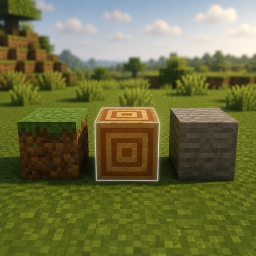

# Minecraft Block Shuffle Fabric



An unofficial Fabric port of [MinecraftBlockShuffle](https://github.com/Matistan/MinecraftBlockShuffle), originally created by Matistan.

Minecraft Block Shuffle is a multiplayer minigame where every participant receives a random target block and must stand on it before the round timer expires. This port targets Minecraft Java Edition 1.21.11 and works on dedicated Fabric servers and Open-to-LAN worlds.

## Requirements

- Minecraft Java Edition 1.21.11
- Fabric Loader 0.18.1 or newer
- Fabric API for Minecraft 1.21.11
- Java 21

## Installation

### Dedicated server

1. Install Fabric Loader for Minecraft 1.21.11.
2. Copy Fabric API and the Block Shuffle JAR into the server's `mods` directory.
3. Start the server.

Joining players do not need to install the mod.

### Open to LAN

The hosting client must install Fabric API and the Block Shuffle JAR because it runs the integrated server. Other players can join without installing the mod.

## Starting a game

With the default `playWithEveryone` setting, start immediately with:

```mcfunction
/blockshuffle start
```

To select players manually, disable `playWithEveryone` in the configuration and run:

```mcfunction
/blockshuffle add @a
/blockshuffle start
```

## Gameplay

Every active player receives a localized target block name. Standing on that block completes the round objective. The action bar shows the current round, target, remaining time, and score.

Two game modes are available:

- Elimination mode removes players who fail to reach their target.
- Points mode awards points until a player reaches the configured winning score.

## Difficulty levels

```mcfunction
/blockshuffle difficulty
/blockshuffle difficulty easy
/blockshuffle difficulty normal
/blockshuffle difficulty hard
```

- `easy` focuses on common Overworld blocks.
- `normal` adds ores, processed materials, decorative blocks, and dimension-specific materials.
- `hard` also permits rare and expensive survival-obtainable blocks.

The default difficulty is `normal`. Blocks manually added to the ban list remain excluded at every difficulty.

## Random teleportation

```mcfunction
/blockshuffle teleport
/blockshuffle teleport off
/blockshuffle teleport shared
/blockshuffle teleport separate
```

- `off` disables random teleportation.
- `shared` teleports all active players to the same safe location.
- `separate` gives every active player an independent destination.

The default mode is `shared`. It triggers on rounds 1, 4, 7, and so on. Destinations are limited to safe Overworld ground inside the world border, and players receive brief damage protection after teleporting.

## Commands

| Command | Purpose |
| --- | --- |
| `/blockshuffle add <players>` | Add one or more players |
| `/blockshuffle remove <players>` | Remove one or more players |
| `/blockshuffle start` | Start a match |
| `/blockshuffle reset` | Stop and reset the match |
| `/blockshuffle skip` | Skip the current round |
| `/blockshuffle list` | Show selected players and scores |
| `/blockshuffle difficulty <easy\|normal\|hard>` | Select the target block difficulty |
| `/blockshuffle teleport <off\|shared\|separate>` | Select the random teleport mode |
| `/blockshuffle ban <block>` | Exclude a block from target selection |
| `/blockshuffle unban <block>` | Remove a block from the ban list |

The current alpha exposes commands to all players so they work reliably in integrated Open-to-LAN servers. Granular permission integration is planned for a later release.

## Configuration

The first launch generates:

```text
config/minecraft-block-shuffle.json
```

Important options include:

| Option | Default | Description |
| --- | --- | --- |
| `roundSeconds` | `300` | Time available per round |
| `gameMode` | `1` | `0` for elimination, `1` for points |
| `pointsToWin` | `5` | Winning score in points mode |
| `difficulty` | `normal` | Target block difficulty |
| `playWithEveryone` | `true` | Automatically include every online player |
| `sameBlockForEveryone` | `false` | Give everyone the same target block |
| `enableNetherBlocks` | `false` | Include Nether-related blocks |
| `randomTeleportMode` | `shared` | `off`, `shared`, or `separate` |
| `randomTeleportEveryRounds` | `3` | Number of rounds between teleports |
| `randomTeleportRadius` | `500` | Maximum teleport distance from the current area |
| `bannedBlocks` | built-in list | Blocks excluded from target selection |

Restart the game or server after editing the JSON file directly.

## Building from source

```bash
./gradlew build
```

The remapped Fabric JAR is written to `build/libs/`.

The original Spigot source remains under `src/main/java` as migration reference. The Fabric build compiles only `src/fabric/java`.

## Alpha limitations

- The original Bukkit scoreboard is currently replaced by action-bar information.
- LuckPerms and granular permission-node integration are not yet available.
- Difficulty does not yet increase automatically with the round number.
- NeoForge is not supported yet.

## Issues

Report Fabric-port bugs and feature requests in the [HanLax93 fork issue tracker](https://github.com/HanLax93/MinecraftBlockShuffle/issues).

Please report original Spigot plugin issues to the [upstream project](https://github.com/Matistan/MinecraftBlockShuffle).

## Credits and license

MinecraftBlockShuffle was originally created by [Matistan](https://github.com/Matistan). This repository contains an unofficial Fabric port maintained by HanLax93.

The original project and this port are distributed under the [MIT License](LICENSE).

```text
Copyright (c) 2025 Matistan
```
